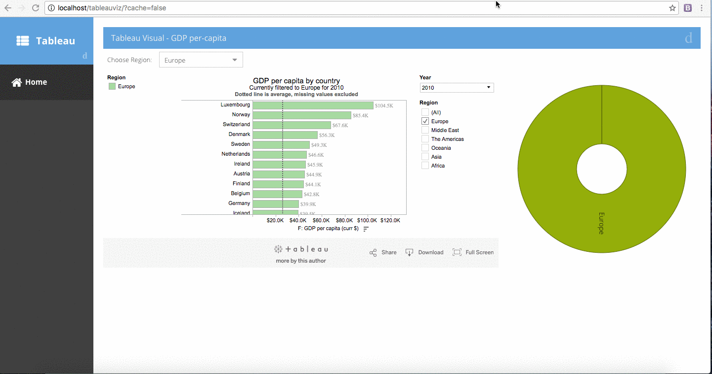

# tableau-extjs
A sample Ext JS application with two-way interaction with Tableau visualization

## How to run
1. Check out the code
2. Create `ext` folder and keep the Ext JS 6.2 SDK inside it
3. Run `sencha app refresh` and run `sench app watch` to run the application
4. Access `http://localhost:1841/` in a browser to access the application

